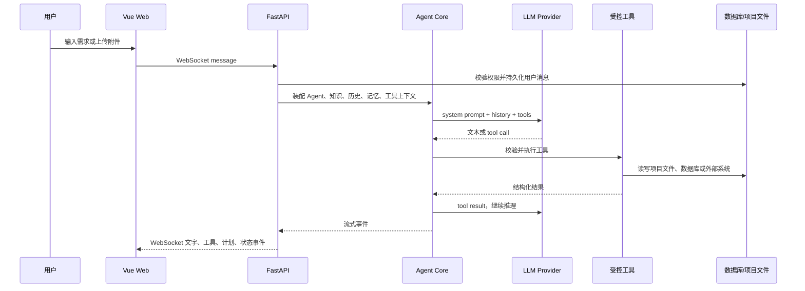

# Agents Universe 实现原理：从聊天到可审计的企业智能体

> 本文以仓库当前代码为准，面向想理解和扩展 Agents Universe 的开发者。它既解释概念，也标出实际代码入口，避免把 README 的产品描述误当成已经自动发生的魔法。

## 1. 先用一句话理解它

Agents Universe 是一个把大语言模型（LLM）放进受控工作环境的全栈平台：

1. 用角色定义、项目知识、会话历史和个人记忆组成模型上下文；
2. 让模型通过标准化的 tool/function calling 选择工具；
3. 在平台代码中执行工具、记录事件、把结果再交回模型；
4. 通过任务计划、权限、沙箱、加密和持久化，让过程可见、可控、可追溯。

因此，模型负责的是“理解、决策、生成下一步”；真正读文件、访问 Jira、调用 API、写知识、创建任务的，是 Python 工具实现。这个分工是理解整个项目的钥匙。

## 2. 为什么它不只是聊天框

普通聊天通常是：

```text
用户输入 -> 模型回答 -> 展示文本
```

本平台的一个回合更接近：



模型不拥有主机权限，也不直接持有业务密钥。它只能提出一次有 JSON Schema 约束的工具调用，平台根据当前用户、项目和会话构造的 `ToolContext` 决定该调用实际能做什么。

## 3. 仓库与运行时分层

| 层次 | 目录 | 责任 |
| --- | --- | --- |
| Web UI | `packages/web` | Vue 3 三栏界面、流式状态、项目/会话/记忆面板 |
| API 服务 | `packages/api` | FastAPI REST/WebSocket、鉴权、数据库模型、密钥保管、回合持久化 |
| Agent 引擎 | `packages/agent-core` | 模型抽象、Agent loop、工具、知识加载、压缩、沙箱 |
| 可复用行为资产 | `agents`、`workflows`、`knowledge` | 角色提示词、技能、工作流、框架知识和项目模板 |
| 每个项目的工作区 | `PROJECTS_ROOT/{slug}` | 项目级 agent/skill/workflow/knowledge、测试和临时产物 |

其中最重要的边界是：`agent-core` 是不依赖 HTTP 的 Python 库；API 层负责把 Web、数据库与用户身份接到这个库上。这使得 Agent 循环可以被测试，也便于未来接入命令行或后台任务入口。

## 4. 一次用户请求如何真正执行

主调用链为：

```text
packages/web/src/composables/useWebSocket.ts
  -> /ws/conversations/{conversation_id}
  -> packages/api/src/api/websocket/handlers.py
  -> packages/api/src/api/services/agent_turn.py::run_turn
  -> packages/agent-core/src/agent_core/agent.py::Agent.run
  -> Agent._run_loop
```

### 4.1 前端：不仅接收文字，也接收运行状态

`useWebSocket.ts` 为每个会话维护连接、心跳、断线重连和历史补偿。连接恢复后，前端会重新拉取消息、任务和最近一次运行记录，而不是假设流式连接永不丢失。这解释了为什么 UI 能展示“模型已选择”“知识已加载”“工具调用”“计划任务”和持续文本，而不只是一个 loading 圈。

### 4.2 API：先确定“谁、在哪个项目、用哪个模型”

`run_turn()` 会先验证会话归属、会话状态和项目状态，再加载当前用户可用的模型凭据。随后它：

- 解析会话默认 Agent，或处理 `@Agent` 仅当前轮切换；
- 加载该角色的 Markdown frontmatter 与正文；
- 构造项目级 `ToolContext`，其中含 `project_id`、`user_id`、项目根目录、数据库会话、附件索引和集成配置；
- 装载项目知识、对话历史、个人记忆、未完成计划；
- 先持久化用户消息，再创建可恢复的 `ConversationRun`；
- 创建短生命周期 `Agent` 并把事件转发到 WebSocket，同时将结果与工具活动写回数据库。

这里“每回合新建 Agent”很重要：Provider HTTP client、工具上下文和动态注入的 MCP 连接都不会被无边界地跨会话复用。

### 4.3 Agent：提示词装配器 + 工具循环

`Agent.run()` 的步骤可概括为：

1. 选定显式模型或自动路由后的模型，并发出 `model_selected` 事件；
2. 建立 system prompt；
3. 根据用户消息激活最多三个触发式技能；
4. 按供应商上下文窗口压缩历史；
5. 把 system、history、当前用户消息（可能含图像）和工具 JSON Schema 发送给 Provider；
6. 进入 `_run_loop`：模型要求工具时执行工具，追加 tool result，再调用模型；模型自然结束时输出最终回答。

这正是常说的 ReAct/tool-use 模式的工程化版本：模型在“思考/决定”与“行动/观察”之间循环。不同点是平台把行动包在明确的工具边界中，并把每一步做成 UI 事件和可保存记录。

## 5. 多模型不是简单换 API Key

`agent_core.providers.base.LLMProvider` 统一了不同厂商的核心能力：

- `complete()` 与 `stream()`；
- 统一的 `Message`、`ToolDefinition`、`StreamChunk`；
- 标准化结束原因，例如 OpenAI 的 `tool_calls` 与 Anthropic 的 `tool_use` 都映射到 `StopReason.TOOL_USE`；
- 模型上下文长度、视觉能力、工具调用能力。

`providers/registry.py` 延迟加载 Anthropic、OpenAI、Azure OpenAI、Google Gemini 的实现。好处是上层 Agent 不必理解各家响应格式；代价是要持续维护各供应商的 tool-call 和流式协议差异。

系统还根据上下文窗口计算可用历史预算，并在请求字节数过大时压缩或降级知识上下文。这里值得区分两个概念：`token_budget` 更多是产品展示和会话预算；真正能否发出请求仍受所选模型 `context_window`、输出保留和请求大小限制控制。

## 6. Agent 定义、技能与工作流：把 Prompt 变成文件资产

一个 Agent 不是数据库里的一段神秘配置，而是 `agents/*.agent.md`：YAML frontmatter 描述 `slug`、工具白名单、技能、工作流、知识过滤和 token 预算；Markdown body 是角色行为准则。

以 `agents/tech-lead.agent.md` 为例，它声明了 `git_repo`、`github`、`jira`、`knowledge_rw` 等工具，并把 PR/Jira 的权威来源顺序写入角色指令。运行时 `AgentConfig` 读取这些字段，工具注册表只暴露声明过的内置工具。

技能是可被角色引用或按用户语句触发的 Markdown 指令；工作流也是 Markdown 文件。当前实现没有把工作流编译为刚性的 BPMN/YAML 执行引擎，而是把“何时读取、按何步骤做”的可审查流程交给模型遵循。这是一种有意的取舍：柔性强、易开源共建，但质量仍依赖模型遵循度、工具约束与测试门禁。

项目可覆盖同名全局 Agent、Skill、Workflow。这相当于软件配置的 shadowing：全局资产给默认能力，项目资产提供本地术语、流程和权限边界。

## 7. 规划：从一句需求到可追踪任务

`plan_task` 在 `tools/planner.py` 中声明为一个普通工具，但 Agent loop 会拦截它，将模型给出的 `id`、依赖、需要工具和复杂度转为任务模式，而非简单返回一段文本。

任务会落到 `agent_tasks` 表：包含状态、依赖、预估复杂度、实际模型、步骤、进度、结果摘要和错误。`messages` 表也记录每条消息的 Agent slug、模型名和工具调用 JSON。由此形成两类审计：

- 对话审计：谁在何时向哪个 Agent 提问，哪个模型回答；
- 工作审计：计划了哪些任务、调用了哪些工具、任务成功还是失败。

规划不等于确定性执行。LLM 生成计划本身仍有不确定性，平台的改进方向通常是：给关键动作加结构化验收条件、将依赖检查做成代码、对高风险操作加入确认，而不是只把“先规划”写进提示词。

## 8. 知识系统：为何不用向量检索

该项目刻意采用“文件知识 + 显式链接 + 两层加载”，而非 embedding/RAG 为主的架构。`knowledge/loader.py` 的规则是：

- primary 文件：没有 `knowledge_level: detail` 的 Markdown，在项目选中时直接全文放入上下文；
- detail 文件：索引到数据库中，只把 slug、摘要、层级等元数据展示给模型，需要时由 `knowledge_rw load` 读取全文；
- 超大 primary 文件不会静默消失，而是作为 overflow 条目提示模型按需读取；
- `[[slug]]` 提供显式交叉引用，索引阶段可解析为知识关系；
- 与某个任务关联的 detail 知识可在任务结束时自动卸载，降低后续上下文污染和 token 消耗。

它背后的 AI 观点是：企业知识常有强结构、稳定目录和上下文依赖；“召回几个相似段落”可能遗漏边界条件。全文加载更像让新员工先读项目手册，detail 文件再像需要时翻阅的专项资料。

这不是说向量检索无用。文件很多、单篇很长、问题跨大量弱相关资料时，embedding 检索仍有成本优势。当前设计选择的是可读性、可版本控制、可人工审查和较强的项目整体感，代价是上下文容量和整理质量成为一等问题。

知识写回由 `knowledge_rw` 工具承接。正确的落地方式应是写入可复用的事实、规则、接口或测试模式，而不是把整段聊天记录塞进知识库；历史、版本和 stale 标记让知识修订可追踪。

## 9. 记忆、知识与历史并不是一回事

三者的作用范围不同：

| 概念 | 典型内容 | 生命周期 | 注入位置 |
| --- | --- | --- | --- |
| 会话历史 | 用户与 Agent 的已说内容、工具结果摘要 | 一个 conversation | 每轮 history |
| 个人记忆 | 用户偏好、项目相关的稳定个人事实 | 跨会话、按项目可筛选 | system prompt 的 personal memory context |
| 项目知识 | 领域规则、API、页面图、测试模式 | 项目长期资产 | static/dynamic knowledge context |
| 全局知识 | 框架规则和通用模板 | 仓库长期资产 | 全局知识目录 |

这种分层是上下文工程（context engineering）的核心：不是无限累加记忆，而是让不同稳定性、权限和用途的信息有不同载体。否则提示词会越来越长，旧事实会与新事实冲突，且无法解释“模型为何知道这件事”。

## 10. 工具、MCP 与外部系统接入

内置工具位于 `agent_core/tools/`，包括文件、Shell、浏览器 Playwright、Git/GitHub、Jira、Confluence、SQL、HTTP、知识读写和交付文件等。每个工具继承 `Tool`，提供名称、说明、参数 JSON Schema 和异步 `execute()`。

MCP（Model Context Protocol）用于把外部工具服务器接入平台：

1. 项目中的 `knowledge/integrations/mcp-servers.md` 定义服务目录；
2. API 在运行前同步目录到 `mcp_servers`；
3. Agent frontmatter 写 `mcp` 或 `mcp:<slug>`；
4. `attach_mcp_tools()` 创建连接管理器、发现工具，并以动态 Tool 注入 Agent；
5. 内置工具名称优先，避免外部 MCP 同名覆盖平台能力。

这意味着 MCP 是扩展协议而不是“模型本身的能力”。它解决工具发现和传输标准化；项目仍必须负责凭据解析、SSRF 防护、破坏性操作确认、错误降级和连接清理。

## 11. 企业控制面：身份、密钥、隔离与沙箱

### 11.1 密钥不进入模型上下文

`api/services/token_vault.py` 使用 `cryptography` 的 AES-256-GCM 加密。密钥由服务端 `secret_key` 经 PBKDF2-HMAC-SHA256 和用户 ID 或项目 ID 派生；随机 nonce 与密文一起 Base64 存储。用户 token 与项目 secret 分开建模：前者适合个人身份访问外部系统，后者适合经授权的项目成员共享使用。

关键原则不是“加密后模型可以看”，而是“模型始终看不到明文”。工具按引用在服务端解密并发起请求，日志和错误信息也应避免输出 token。

### 11.2 项目隔离

`ToolContext` 中的项目 ID、工作目录和用户 ID 贯穿工具调用。项目工作区位于 `PROJECTS_ROOT/{slug}`，项目间文件访问被明确禁止。知识查询也按当前项目或全局范围过滤，避免把 A 项目的知识带入 B 项目。

### 11.3 运行不可信命令的边界

`sandbox.py` 体现了“LLM 生成的命令不可信”的工程假设：路径需留在项目根目录，环境变量会移除敏感项，Python 子进程可加载 `sitecustomize` 审计钩子，命令替换、重定向、绝对命令与子进程树都有额外控制。代码执行与 Shell 工具仍是高风险能力，生产环境还应配合容器、只读挂载、网络出口策略、资源配额和人工确认。

平台能降低模型误操作的概率，不能把拥有高权限 token 和 Shell 的 Agent 自动变成零风险系统。高影响动作应始终保留最小权限、目标白名单、显式确认和可回滚机制。

## 12. 前端为什么适合 WebSocket

工具调用和长文本生成都是持续事件而非一次 HTTP 响应。后端通过 `ConversationSession.emit()` 产生模型选择、知识加载、文本增量、工具状态、任务状态、警告与结束事件；API 转发给 WebSocket；Vue store 更新对应 UI。

`useWebSocket.ts` 的连接池、心跳、重连上限和恢复后拉取持久化历史，解决的是一个现实问题：用户切换页面或网络短断时，后台 Agent 可能仍在运行。UI 断线不应导致数据库中已经完成的任务和回答消失。

## 13. 用到的主要开源组件

| 组件 | 用途 | 在项目中的位置 |
| --- | --- | --- |
| Python 3.12 | Agent Core 与 API 运行时 | `agent-core`、`api` |
| FastAPI / Uvicorn | REST API、WebSocket 服务 | `packages/api` |
| SQLAlchemy 2 / Alembic | ORM 和多数据库迁移 | `packages/api` |
| Redis | OAuth 会话与活跃用户等短期状态 | API 服务 |
| OpenAI / Anthropic / Google GenAI SDK | 多厂商模型调用 | `agent_core/providers` |
| MCP Python SDK | 外部 MCP 工具服务器连接 | `tools/mcp_client.py` |
| Playwright | 浏览器自动化 | `browser_playwright.py` |
| Pydantic / python-frontmatter / PyYAML | 输入和 Markdown frontmatter 解析 | core/API |
| cryptography | AES-GCM 密钥加密 | `token_vault.py` |
| tree-sitter-language-pack | 仓库代码图解析 | `knowledge/graph` |
| pandas / matplotlib / openpyxl | 数据处理、图表、Excel | Agent 执行环境 |
| python-pptx / python-docx / reportlab / pypdf | 办公文档生成和读取 | Agent 执行环境 |
| Vue 3 / Pinia / Vue Router | 前端组件、状态与路由 | `packages/web` |
| CodeMirror 6 | 多行 Markdown 编辑器与 @ 提及基础体验 | Web composer |
| Vite / TypeScript / Tailwind | 前端开发、构建、样式 | `packages/web` |

项目的差异化不在于“发明了一个新的基础模型”，而在于把这些组件整合为可复用角色资产、项目知识、工具约束、审计和协作流程。

## 14. 二次开发：应该从哪里下手

### 新增一个角色

1. 在 `agents/` 增加 `*.agent.md`；
2. 用 frontmatter 声明最小工具集合、技能、工作流和知识范围；
3. 在正文写角色目标、权威信息源、确认规则和失败处理；
4. 添加针对 frontmatter、提示词和工具白名单的单元测试；
5. 不要因为“也许有用”就给角色 Shell、SQL 或通用 HTTP 权限。

### 新增一个内置工具

1. 在 `agent_core/tools/` 实现 `Tool` 子类；
2. 将参数设计成窄而明确的 JSON Schema；
3. 在 `ToolContext` 使用项目、用户和会话范围，不从模型文本中信任权限信息；
4. 对网络地址、文件路径、分页、超时、返回大小和敏感字段做验证；
5. 在工具注册表中注册，并仅在需要它的 Agent frontmatter 中声明；
6. 为成功、拒绝、超时、权限不足、跨项目尝试分别写测试。

### 接入一个外部 MCP 服务

1. 把服务器目录写入项目 `knowledge/integrations/mcp-servers.md`；
2. 在所需 Agent 中声明 `mcp` 或精确的 `mcp:<slug>`；
3. 使用 secret reference，不把 token 写进 Markdown 或提示词；
4. 验证工具发现失败时 Agent 能降级工作；
5. 为会写数据、发消息、删资源的工具建立确认策略。

### 修改知识模板

1. 先改 `knowledge/_template/` 和 `knowledge/categories.yaml`；
2. 区分 primary 与 `knowledge_level: detail`；
3. 用稳定 slug 和 `[[slug]]` 交叉引用，而非依赖文件名猜测；
4. 让知识保持短、可维护、能被人审阅；
5. 重新运行索引并检查加载数量、overflow 与动态加载行为。

## 15. 开发与排障的推荐路径

1. 从 `packages/api/src/api/services/agent_turn.py::run_turn` 看一次请求如何装配；
2. 再看 `packages/agent-core/src/agent_core/agent.py::Agent.run` 与 `_run_loop`，理解模型和工具循环；
3. 从目标 Agent 的 Markdown 反查其工具、技能和工作流；
4. 到 `agent_core/tools/` 找真实副作用发生处；
5. 通过 `packages/api/src/api/models/conversation.py`、`conversation_runs.py` 和前端 WebSocket 事件查审计与恢复；
6. 先跑局部测试：core 用 `pytest`，API 用 `pytest`，web 用 `npm test`；前端完整构建用 `npm run build`。

对于“为什么模型做了这件事”的问题，优先检查以下四项，而非只看最后回答：角色 system prompt、命中的 skill、加载的 project knowledge、模型当轮可见的工具定义。它们共同构成了模型实际看到的工作环境。

## 16. 最后用一个心智模型收束

可以把 Agents Universe 看成企业中的“受约束数字员工系统”：

- LLM 是会阅读、归纳、选择下一步的推理引擎；
- Agent Markdown 是岗位说明书；
- Skills 和 Workflows 是 SOP 与培训材料；
- Knowledge 是项目文档和组织经验；
- Tools/MCP 是办公软件、业务系统和执行能力；
- `ToolContext`、鉴权、密钥库和沙箱是权限系统与安全制度；
- `agent_tasks`、消息、运行记录和 WebSocket 事件是工作台、日志和审计轨迹。

真正让它“能干活”的不是某一段 Prompt，而是这些层次协同：模型负责判断，代码负责执行和约束，文件负责沉淀经验，数据库和事件负责留下可追溯证据。扩展它时也应保持这个边界：把稳定规则变成代码或可审查资产，把不确定性留给模型，并对任何高影响动作保持明确的控制面。