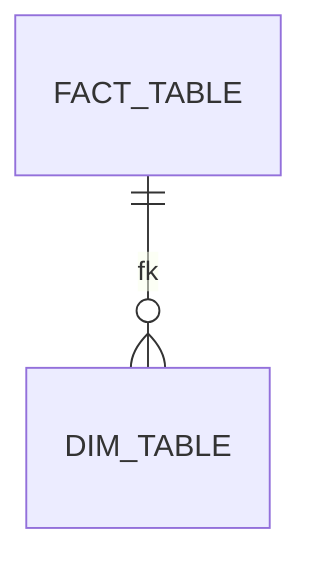

# Data Model

Core tables and their relationships used by analysis work.

## Core Tables

| Table | Layer (ODS / DWD / DWS / ADS) | Granularity | Description |
|-------|-------------------------------|-------------|-------------|
| | | | |

## Fact-Dimension Relationships

## Data Quality Rules

| Table | Rule (uniqueness / null / reconciliation threshold) | Severity | Owner |
|-------|------------------------------------------------------|----------|-------|
| | | | |

## Related Knowledge

- [[technical/data-source-map]]
- [[technical/data-pipelines]]
- [[domain/metric-catalog]]
