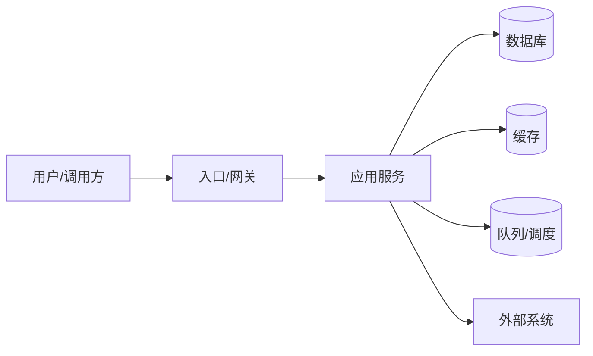

# 旧系统架构

旧系统的 as-is 现状盘点：回答「现在系统长什么样、为什么难改」。只记录**现状事实**；目标设计写在 [[technical/target-architecture]]，逐要素新旧对照写在 [[technical/evolution-mapping]]。

## 架构总览

- (to be filled: 系统边界、部署形态——单体/分层/SOA、上下游系统、租户与环境划分)
- 记录影响改造决策的整体结构事实：会话模型、多租户方式、同步与异步边界、数据流向
- 实现细节放在各自链接条目：接口面在 [[technical/legacy-api-map]]，数据在 [[technical/legacy-data-model]]，资源接入在 [[technical/legacy-resources]]

## 组件清单

| 组件 | 职责 | 技术栈/版本 | 部署方式 | 备注 |
|------|------|------------|----------|------|
| (to be filled) | (to be filled) | (to be filled) | (to be filled) | (to be filled) |
| (to be filled) | (to be filled) | (to be filled) | (to be filled) | (to be filled) |

## 技术栈与运行环境

| 层次 | 技术/版本 | 生命周期/EOL 风险 |
|------|-----------|-------------------|
| 前端 | (to be filled) | (to be filled) |
| 后端 | (to be filled) | (to be filled) |
| 数据存储 | (to be filled) | (to be filled) |
| 中间件/基础设施 | (to be filled) | (to be filled) |

- (to be filled: 运行时版本约束、已知 CVE 或不兼容依赖、升级被卡住的具体原因)

## 部署与拓扑

- (to be filled: 环境清单——开发/测试/生产，各环境地址登记在 [[technical/legacy-resources]])
- (to be filled: 发布方式、依赖的构建流水线与基础设施)
- (to be filled: 单点、容量瓶颈、当前扩展方式)

## 集成与外部依赖

旧系统**调用或被调用**的外部系统。旧系统自身对外的接口面在 [[technical/legacy-api-map]]，不在本表重复：

| 对接系统 | 方向(入/出) | 协议/接口 | 用途 | 凭据位置 |
|----------|-------------|-----------|------|----------|
| (to be filled) | (to be filled) | (to be filled) | (to be filled) | (to be filled: secret_ref 名) |

- 第三方与自建 API 的目录、基地址与调用规则见 [[integrations/custom-api]]

## 痛点与技术债

改造的直接动因，按严重度排序：

| 问题 | 影响 | 严重度 | 改造期望 |
|------|------|--------|----------|
| (to be filled) | (to be filled) | (to be filled) | (to be filled) |

- (to be filled: 历史事故、维护成本、人才断层、供应商锁定等背景事实)

## 学习入口

- [[domain/context]]
- [[domain/glossary]]
- [[technical/legacy-data-model]]
- [[technical/legacy-api-map]]
- [[technical/legacy-resources]]
- [[technical/target-architecture]]
- [[technical/evolution-mapping]]
- [[domain/migration-plan]]
- (to be filled: 架构文档、代码仓库、部署仓库地址)
