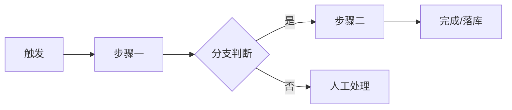

# 旧系统业务流程

旧系统承载的业务流程现状（as-is）：核心流程、步骤、规则与人工环节。目标流程写在 [[domain/target-business-process]]，流程级新旧处理策略写在 [[technical/evolution-mapping]] 的业务流程对照。

## 核心业务流程清单

| 流程 | 触发场景 | 频率 | 参与角色 | 主要痛点 |
|------|----------|------|----------|----------|
| (to be filled) | (to be filled) | (to be filled) | (to be filled) | (to be filled) |
| (to be filled) | (to be filled) | (to be filled) | (to be filled) | (to be filled) |

- (to be filled: 只列改造范围内的流程；每条流程一个 `##` 小节展开步骤)

## 流程步骤：{PROCESS_NAME}

- 步骤表：

| # | 步骤 | 执行者 | 系统动作 | 分支/异常 |
|---|------|--------|----------|-----------|
| 1 | (to be filled) | (to be filled) | (to be filled) | (to be filled) |

- (to be filled: 流程的输入与输出单据、落库位置、完成的判定标准)

## 业务规则与计算口径

- (to be filled: 状态机与流转条件——哪些状态可跳、哪些必须人工确认)
- (to be filled: 计价/额度/审批阈值等计算口径，公式写清楚)
- (to be filled: 与政策制度冲突时的例外处理)

## 参与角色与分工

- 各角色的定义与能力包见 [[domain/role-matrix]]，本节只写流程中的分工
- (to be filled: 每个流程的发起人、审核人、执行人、知会人)
- (to be filled: 跨部门交接点与等待时长)

## 人工环节与痛点

| 环节 | 为什么靠人工 | 频率 | 改造期望(自动化/保留) |
|------|--------------|------|------------------------|
| (to be filled) | (to be filled) | (to be filled) | (to be filled) |

- (to be filled: Excel/邮件/口头等游离在系统外的步骤——改造最容易漏掉的部分)

## 学习入口

- [[domain/context]]
- [[domain/role-matrix]]
- [[domain/target-business-process]]
- [[technical/legacy-architecture]]
- [[technical/legacy-api-map]]
- [[technical/evolution-mapping]]
- [[domain/migration-plan]]
- (to be filled: 流程图原始文件、SOP 文档、培训材料位置)
