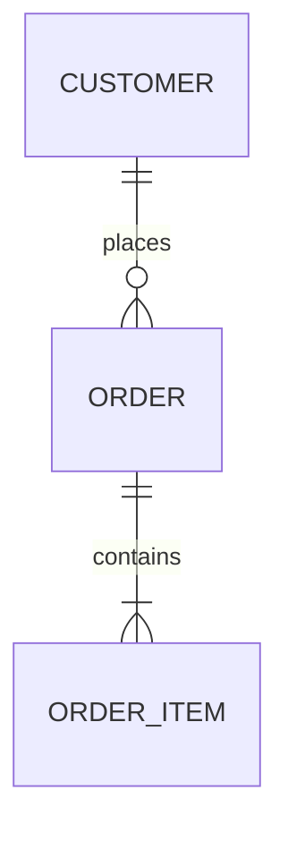

# 旧系统数据模型

迁移前的旧库盘点：核心表、数据质量与迁移约束。回答「数据长什么样、迁移会踩什么坑」；新库设计写在新系统条目里，新旧表逐项对照写在 [[technical/evolution-mapping]]。

## 数据概览

- 存储类型与规模：(to be filled: RDBMS/NoSQL/文件各自实例数、数据量级、增长趋势)
- (to be filled: 字符集/编码、历史归档策略、备份策略)
- 主数据与源头：(to be filled: 哪些表是 source of truth，哪些是冗余/缓存)

## 核心表清单

| 表/集合 | 用途 | 预估行数 | 增长趋势 | 是否迁移 | 备注 |
|---------|------|----------|----------|----------|------|
| (to be filled) | (to be filled) | (to be filled) | (to be filled) | (to be filled) | (to be filled) |
| (to be filled) | (to be filled) | (to be filled) | (to be filled) | (to be filled) | (to be filled) |

- (to be filled: 只列改造涉及的核心表；全量清单可另建文件挂在本文件下)

## 关键实体关系

- (to be filled: 主键策略——自增/雪花/复合，迁移时是否需要重映射)
- (to be filled: 软删除标记、逻辑唯一键、跨库外键等隐性关系)

## 数据质量与一致性

| 表 | 规则(唯一/非空/对账阈值) | 严重度 | 负责人 |
|----|--------------------------|--------|--------|
| (to be filled) | (to be filled) | (to be filled) | (to be filled) |

- (to be filled: 已知脏数据、历史重复、手工修数记录——迁移前必须清洗的项)

## 迁移约束

- 自增 ID 与主键：(to be filled: 新旧 ID 冲突处理、重映射策略)
- 历史数据：(to be filled: 保留期、冷热分层、是否带入新库)
- 双写与转换：(to be filled: 字段重命名/类型转换/单位换算约束，逐项对照见 [[technical/evolution-mapping]])
- (to be filled: 大表迁移方式——停机窗口、分批、回填与校验)

## 学习入口

- [[technical/legacy-architecture]]
- [[technical/legacy-api-map]]
- [[technical/evolution-mapping]]
- [[domain/migration-plan]]
- [[domain/glossary]]
- (to be filled: 建表脚本、数据字典、ER 图来源)
