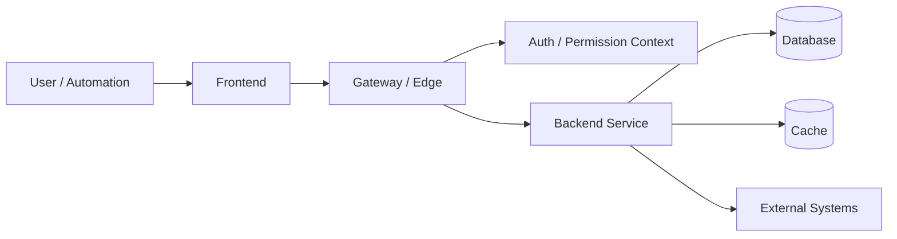

# System Architecture

## Architecture Overview

- (to be filled: product boundary, frontend applications, backend services, gateways, downstream systems, shared infrastructure, and tenant/project boundaries)
- Record high-level architecture decisions affecting testing, automation, debugging, and agent reasoning.
- Keep implementation details in the linked technical maps; this page explains how the pieces fit together.

## Component Map

| Component | Responsibility | Owned APIs / UI | Dependencies | Notes |
|-----------|----------------|-----------------|--------------|-------|
| Frontend / UI | (to be filled) | (to be filled) | (to be filled) | (to be filled) |
| Gateway / Edge | (to be filled) | (to be filled) | (to be filled) | (to be filled) |
| Backend service | (to be filled) | (to be filled) | (to be filled) | (to be filled) |
| Data store | (to be filled) | (to be filled) | (to be filled) | (to be filled) |
| External system | (to be filled) | (to be filled) | (to be filled) | (to be filled) |

## Request Flow

## Architecture Views

### Product Context

- Users and entry points: (to be filled)
- System boundary: (to be filled)
- Upstream systems: (to be filled)
- Downstream systems: (to be filled)
- External outputs: (to be filled: files, reports, notifications, callbacks)

### Service Collaboration

- Frontend to gateway/service calls: (to be filled)
- Gateway routing and DTO transformation: (to be filled)
- Service-to-service collaboration: (to be filled)
- Async jobs, queues, scheduled tasks, or callbacks: (to be filled)

### Data And Integration Boundaries

- Source-of-truth services or tables: (to be filled)
- Read/write ownership rules: (to be filled)
- Tenant, company, region, or environment routing rules: (to be filled)
- Shared directories, object storage, or report outputs: (to be filled)

## Permission And Authorization Model

- Permission source: (to be filled: identity provider, role store, entitlement source, gateway, or upstream system)
- Permission enforcement point: (to be filled: frontend route guard, gateway, backend service, or multiple layers)
- Backend-service expectation: does each backend service perform its own business authorization, or trust upstream/gateway-enforced authorization?
- Testing implication: with gateway-enforced permission, permission-negative tests should enter via the gateway/UI path first; direct service calls may bypass the real authorization boundary unless the service also implements its own guard.

## Data Ownership

| Data Object | Owning Component | Read Paths | Write Paths | Notes |
|-------------|------------------|------------|-------------|-------|
| (to be filled) | (to be filled) | (to be filled) | (to be filled) | (to be filled) |

## Integration Points

- Inbound integrations: (to be filled)
- Outbound integrations: (to be filled)
- Async jobs / MQ / scheduled tasks: (to be filled)
- File outputs / shared directories / reports: (to be filled)
- Observability anchors: (to be filled: logs, trace IDs, audit records, status tables, operation records)

## Operational Risks For Testing

- Gateway bypass risk: direct backend calls may not prove user-facing permission behavior.
- Data-source / tenant routing risk: gateway, company, tenant, region, or environment context may change downstream behavior.
- Contract drift risk: gateway, frontend, and backend DTOs may differ.
- Configuration branch risk: feature flags, rollout rules, customer/vendor configuration, or environment data may change the real flow.
- Async timing risk: queues, scheduled jobs, callbacks, and report generation may require polling and observable completion anchors.

## High-Priority Architecture Learning Entry Points

- [[domain/context]]
- [[technical/technical-stack]]
- [[technical/api-map]]
- [[technical/page-map]]
- [[technical/kong-map]]
- [[technical/permission-matrix]]
- (to be filled: architecture docs, gateway route config, OpenAPI definitions, frontend route guards, backend controller/service anchors)
