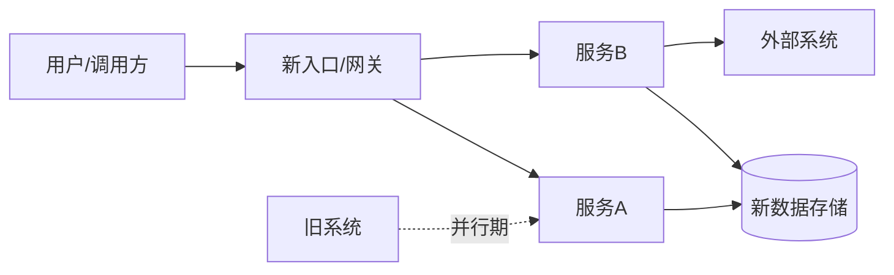

# 新系统架构

新系统的目标架构（to-be）与选型决策。旧系统现状见 [[technical/legacy-architecture]]；逐要素新旧对照的权威在 [[technical/evolution-mapping]]，本文件只记目标形态与「为什么这么选」。

## 目标架构总览

- (to be filled: 目标边界、形态——单体/微服务/事件驱动、与旧系统并行期的关系)
- 改造范围与不在范围内的部分：(to be filled: 明确砍掉/保留/外购的边界)

## 组件与职责

| 组件 | 职责 | 选型 | 部署 | 替代的旧组件 |
|------|------|------|------|--------------|
| (to be filled) | (to be filled) | (to be filled) | (to be filled) | (to be filled: 见 [[technical/legacy-architecture]]) |

- (to be filled: 复用的既有组件与新购/自研组件的划分)

## 选型与决策记录

| 决策点 | 候选 | 结论 | 理由 | 关联差异 |
|--------|------|------|------|----------|
| (to be filled) | (to be filled) | (to be filled) | (to be filled) | (to be filled: evolution-mapping 条目) |

- 决策只记结论与权衡；逐要素对照细节写 [[technical/evolution-mapping]]，不在本表铺开

## 部署与环境

- (to be filled: 环境划分——开发/测试/预发/生产，基础设施与发布方式)
- (to be filled: 容量规划、扩展策略、与旧系统共存期的流量与数据拓扑)
- (to be filled: 新环境地址与接入信息登记到 [[technical/legacy-resources]] 的资源表)

## 与旧系统的关键差异

本节只记一眼看懂的 headline 差异，逐要素对照以 [[technical/evolution-mapping]] 为准：

- (to be filled: 架构层面最大变化，例如 单体→服务化、同步→事件驱动)
- (to be filled: 数据层面最大变化，例如 分库分表、读写分离)
- (to be filled: 技术栈层面最大变化，例如 语言/框架替换)

## 非功能要求

- 可用性：(to be filled: SLA、容灾、降级目标)
- 性能：(to be filled: 关键链路的时延/吞吐指标)
- 安全：(to be filled: 认证授权模型、合规要求、审计)

## 学习入口

- [[technical/legacy-architecture]]
- [[technical/target-api-map]]
- [[domain/target-business-process]]
- [[technical/evolution-mapping]]
- [[domain/migration-plan]]
- [[domain/context]]
- (to be filled: 目标架构评审文档、ADR 或设计评审记录)
