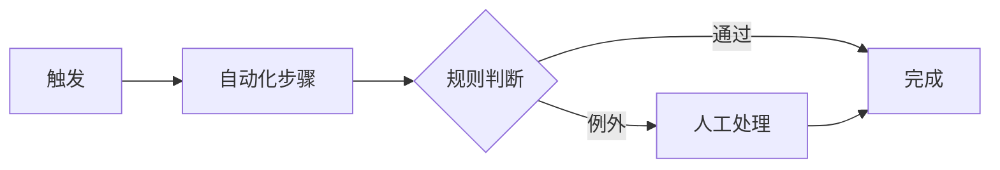

# 新系统业务流程

新系统的目标流程设计（to-be）。旧流程现状见 [[domain/legacy-business-process]]；每条流程的「保留/优化/下线/新增」策略在 [[technical/evolution-mapping]] 的业务流程对照表。

## 新核心流程清单

| 流程 | 对应旧流程 | 变化程度 | 状态 |
|------|------------|----------|------|
| (to be filled) | (to be filled: 见 evolution-mapping 流程对照) | (to be filled: 保留/优化/新增) | (to be filled) |

- (to be filled: 只列改造范围内的流程；每个流程一个 `##` 小节展开步骤)

## 流程步骤：{PROCESS_NAME}

- 步骤表：

| # | 步骤 | 执行者 | 系统动作 | 自动化 |
|---|------|--------|----------|--------|
| 1 | (to be filled) | (to be filled) | (to be filled) | (to be filled: 自动/人工) |

- (to be filled: 新流程的输入输出、落库位置、完成判定标准)

## 简化与自动化点

- (to be filled: 相对旧流程砍掉的审批/抄送/手工录入环节，以及对应旧流程痛点)
- (to be filled: 新增的自动化——规则引擎、异步回调、批量代跑)
- (to be filled: 保留的人工环节及原因)

## 与旧流程的差异

- 差异逐条登记到 [[technical/evolution-mapping]] 业务流程对照表，本节只记设计意图
- (to be filled: 对业务方的培训要点——操作习惯变化最大的地方)

## 学习入口

- [[domain/legacy-business-process]]
- [[domain/role-matrix]]
- [[technical/target-architecture]]
- [[technical/evolution-mapping]]
- [[domain/migration-plan]]
- [[domain/context]]
- (to be filled: 流程评审记录、业务方确认件)
